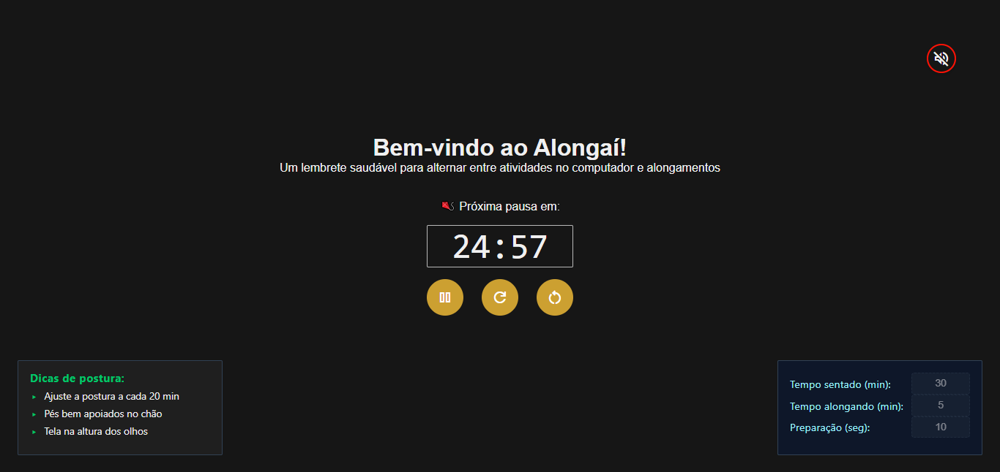

# 🤸‍♂️ Alongaí ⏳

Alongaí é um projeto criado para resolver um problema que encontrei em minha rotina: passar muitas horas sentado em frente ao computador. Inspirado no método Pomodoro, o timer alterna períodos para realização de atividades e alongamentos, ajudando a quebrar o ciclo de sedentarismo.

## 🌐 Link da aplicação

- **(Vercel)**: [ https://alongai-ic.vercel.app (Projeto em execução) ].

## ✨ Principais Funcionalidades

O Alongaí oferece:

- ⚡ Tempos personalizáveis (atividade/alongamento)
- 🔔 Notificação de transição entre modos
- ⏱️ Temporizador de transição

## Como Funciona

- ⏳ **Períodos de atividade**: Tempo dedicado a uma atividade qualquer
- 🔄 **Aviso de transição**: Alerta prévio antes de alternar para o modo ativo
- 🧘 **Pausas ativas**: Intervalos para alongamento ou ficar em pé

## 💻 Prévia da aplicação



## 🛠️ Tecnologias Utilizadas

- React
- TypeScript
- Vite

## 🚀 Como Executar

```bash
  npm install
```

```bash
  npm run dev
```
